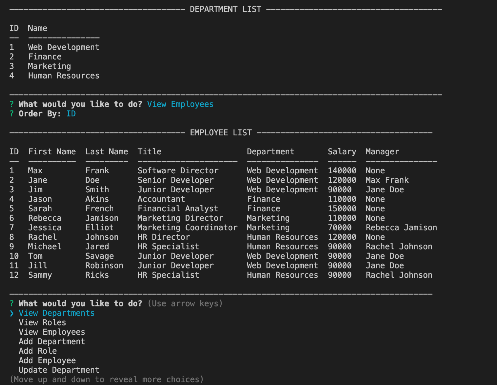
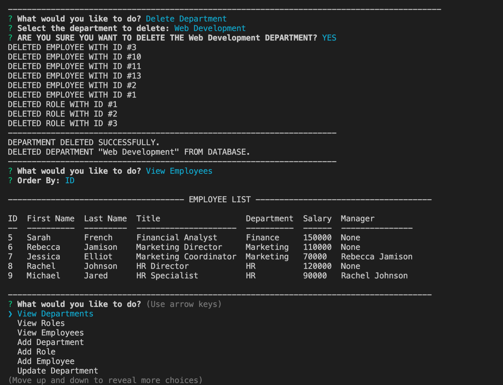

# Employee Management System

## Description 

This CLI Node.js CMS application allows a user to manage a SQL database holding information about a company's departments, roles, and employees. Using the interface, a user can view database information based on various categories as well as insert, modify, and delete entries.  

In order to utilize this program, the user must first run the employeecms.sql file to create the initial database and its tables, as well as some starter data. By default, the application connects to the database using port 3306, user root, and a blank password. The User must change these configurations based on local requirements.  

When this program is run using Node.js (node index.js) in the terminal, the user will be prompted to select an option from the main menu, which allows the user to view, add, modify, or delete departments, roles, or employees. There is also an option for the user to view the total expenses (salaries) of any given department. The user will be taken through a series of questions/prompts depending on the operation being utilized. The Inquirer package is used to gather this information from the user, and the mysql dependency is used to connect the user to the database and interact with its contents. Once an operation is completed, the user will be notified via the command line of any success or error that occured, and then will be redirected to the main menu. Console.table is used to display information in an organized manner. 

Throughout this program, there are error handlers to capture when a database error occurs. In all cases, the user will be redirected to the main menu if a task cannot be completed due to a bad input. 

## Demonstration

[CLICK HERE](https://drive.google.com/file/d/1jZLimYBGTlLh_uMvtHY412uBlPzvbiYu/view) for a video that demonstrates the use of this project! 

## Features

* Runs in the command line using Node.js.
* Written in JavaScript. 
* Uses 'mysql' package to connect to MySQL database. 
* Includes Inquirer to receive and validate user input via command line. 
* Uses console.table to output data to the user.  

## Credits

Michael Hanson
* michaeledwardhanson@gmail.com
* [GitHub](https://github.com/mhans003)
* [LinkedIn](https://www.linkedin.com/in/michaeledwardhanson/)

## License 

Licensed under the [MIT License](./LICENSE.txt).